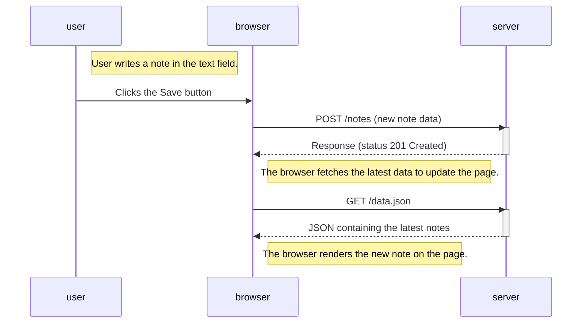

```mermaid
sequenceDiagram
    Note right of user: User writes a note in the text field.
    user->>browser: Clicks the Save button
    browser->>server: POST /notes (new note data)
    activate server
    server-->>browser: Response (status 201 Created)
    deactivate server

    Note right of browser: The browser fetches the latest data to update the page.
    browser->>server: GET /data.json
    activate server
    server-->>browser: JSON containing the latest notes
    deactivate server

    Note right of browser: The browser renders the new note on the page.

```
