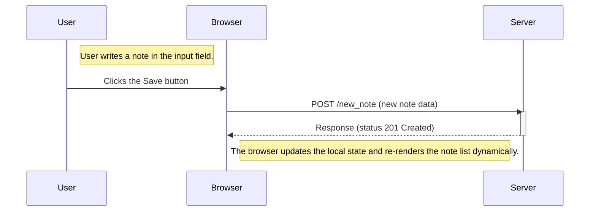

```mermaid
 sequenceDiagram
    participant user as User
    participant browser as Browser
    participant server as Server

    Note right of user: User writes a note in the input field.
    user->>browser: Clicks the Save button
    browser->>server: POST /new_note (new note data)
    activate server
    server-->>browser: Response (status 201 Created)
    deactivate server

    Note right of browser: The browser updates the local state and re-renders the note list dynamically.

```
