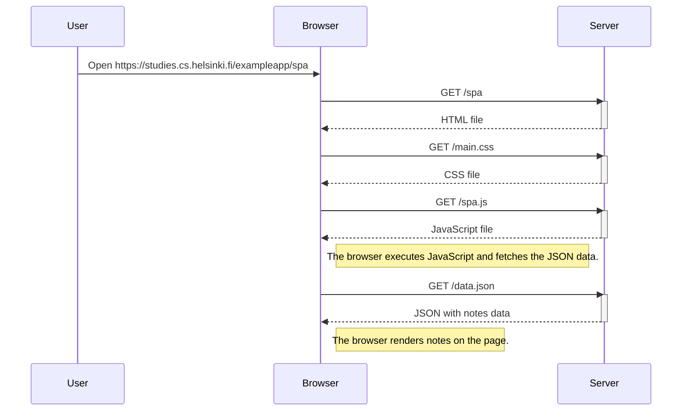

```mermaid
    sequenceDiagram
    participant user as User
    participant browser as Browser
    participant server as Server

    user->>browser: Open https://studies.cs.helsinki.fi/exampleapp/spa
    browser->>server: GET /spa
    activate server
    server-->>browser: HTML file
    deactivate server

    browser->>server: GET /main.css
    activate server
    server-->>browser: CSS file
    deactivate server

    browser->>server: GET /spa.js
    activate server
    server-->>browser: JavaScript file
    deactivate server

    Note right of browser: The browser executes JavaScript and fetches the JSON data.

    browser->>server: GET /data.json
    activate server
    server-->>browser: JSON with notes data
    deactivate server

    Note right of browser: The browser renders notes on the page.

```
